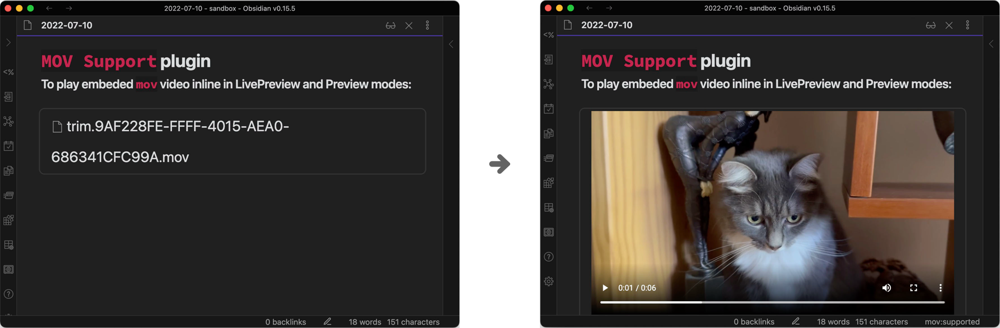
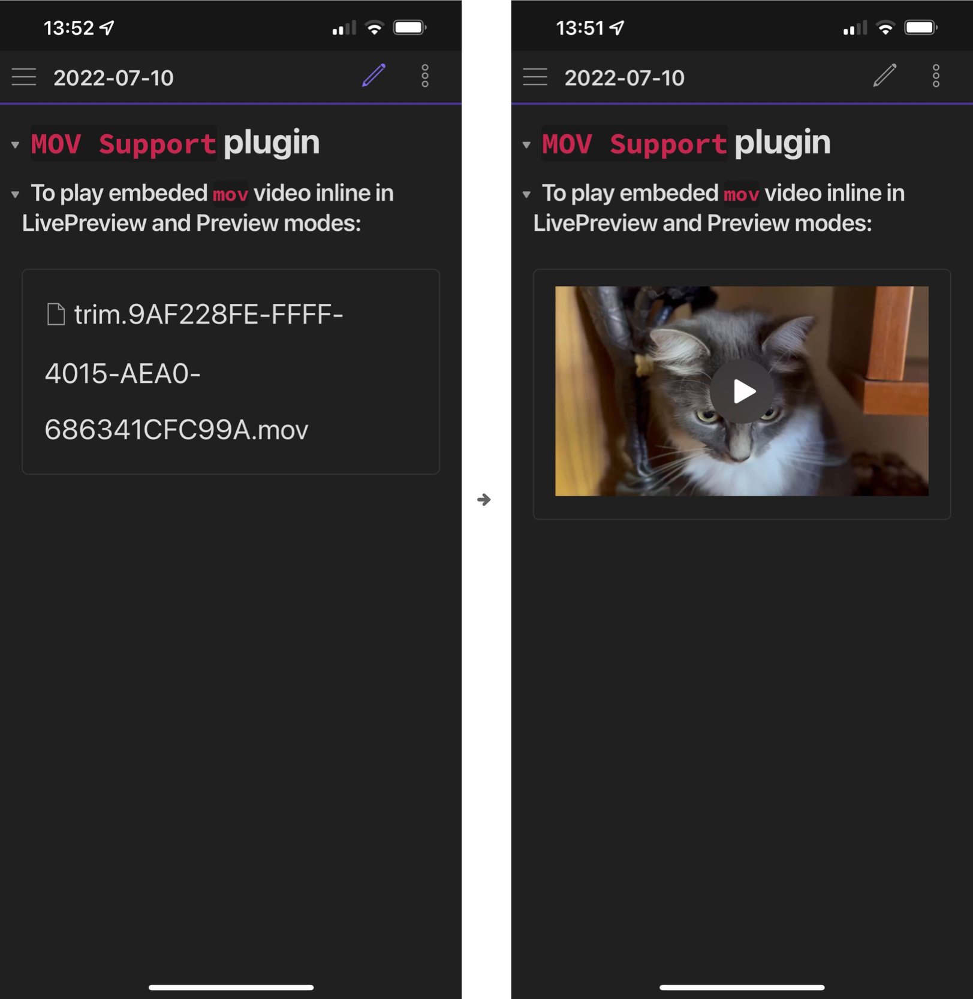

# Obsidian MOV Support 

A simple [Obsidian](https://obsidian.md/) plugin to view and play embedded `.mov` file inline for all platforms. 

## Demo

### desktop

### mobile

## Installation
### From Obsidian

1. Open `Settings` > `Third-party plugin`
2. Make sure Safe mode is **off**
3. Click `Browse community plugins`
4. Search for `MOV Support` 
5. Click `Install`
6. Once installed, close the community plugins window and the patch is ready to use.

### From GitHub

1. Download the Latest Release from the Releases section of the GitHub Repository
2. Put them in your vault's plugins folder: `<vault>/.obsidian/plugins/mov-support`
3. Reload Obsidian
4. If prompted about Safe Mode, you can disable safe mode and enable the plugin.
   Otherwise, head to Settings, third-party plugins, make sure safe mode is off and enable the plugin from there.

